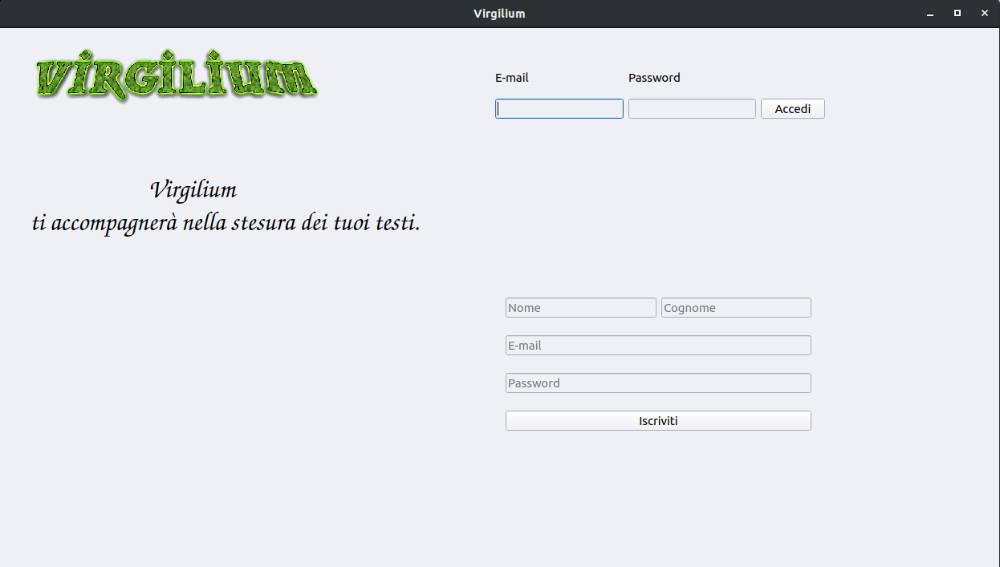
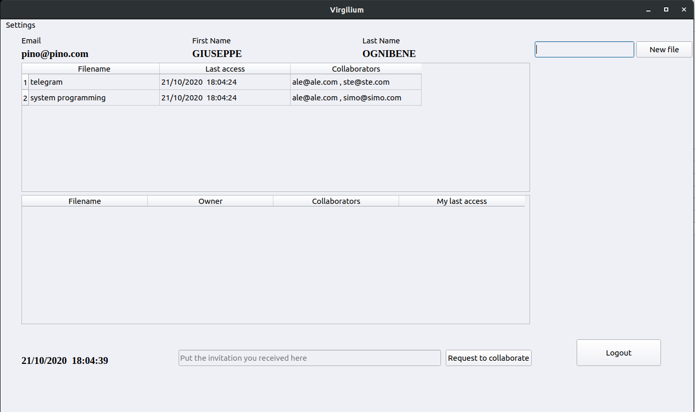
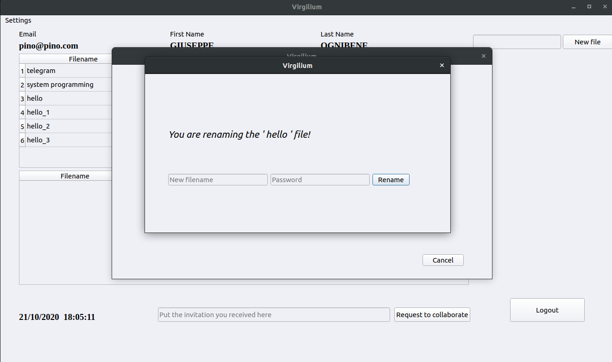
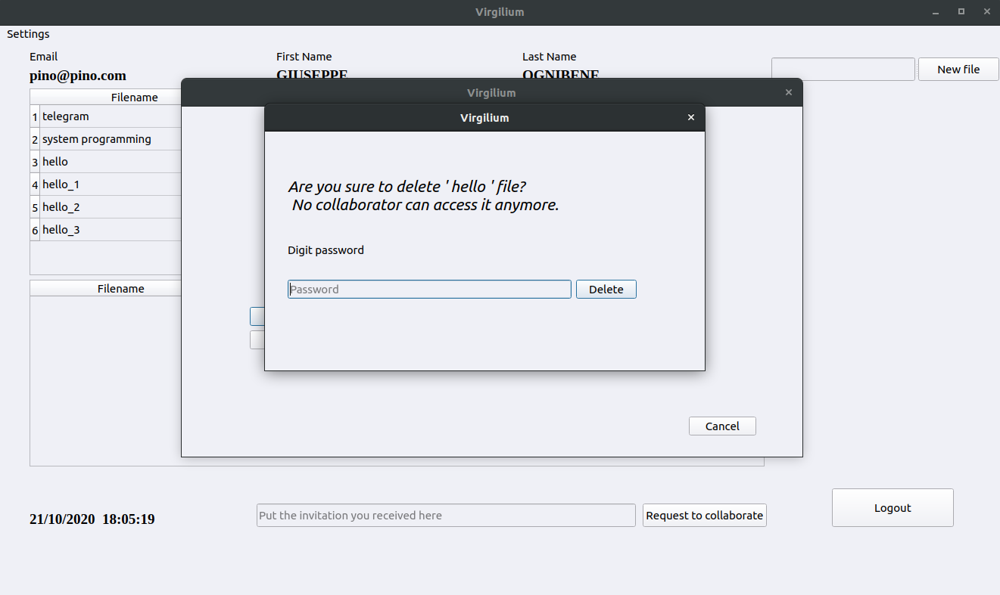
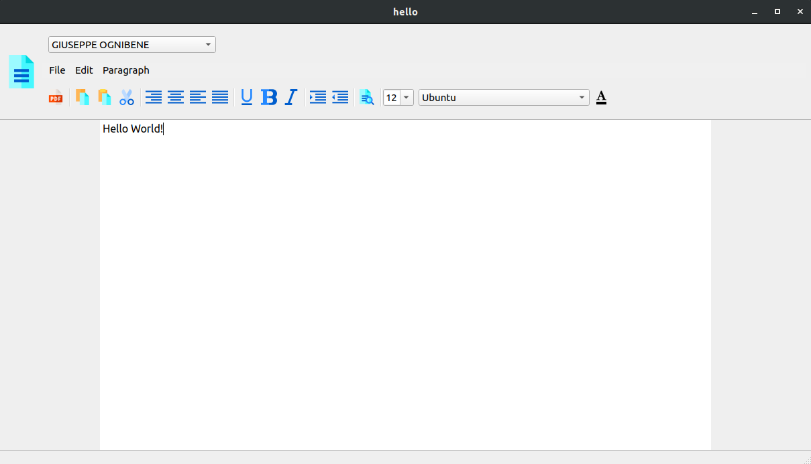
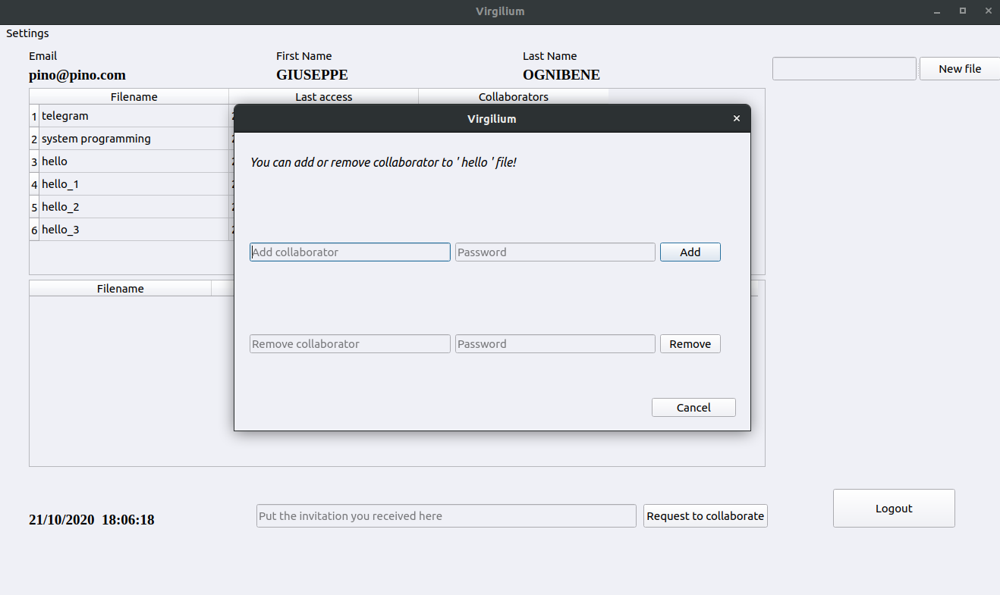
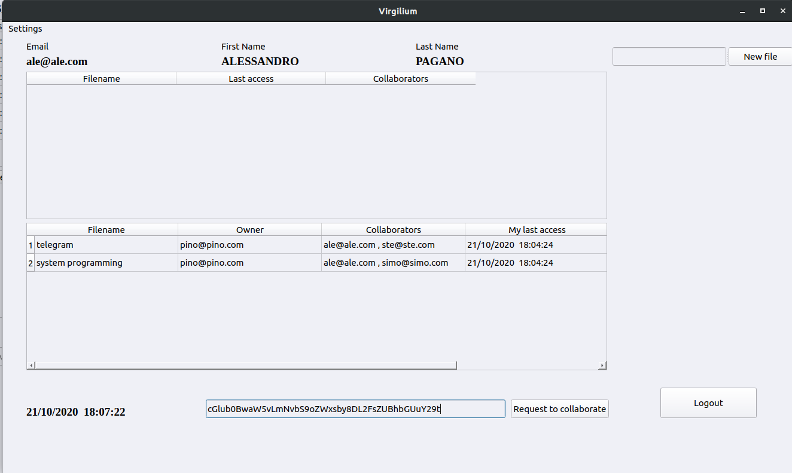
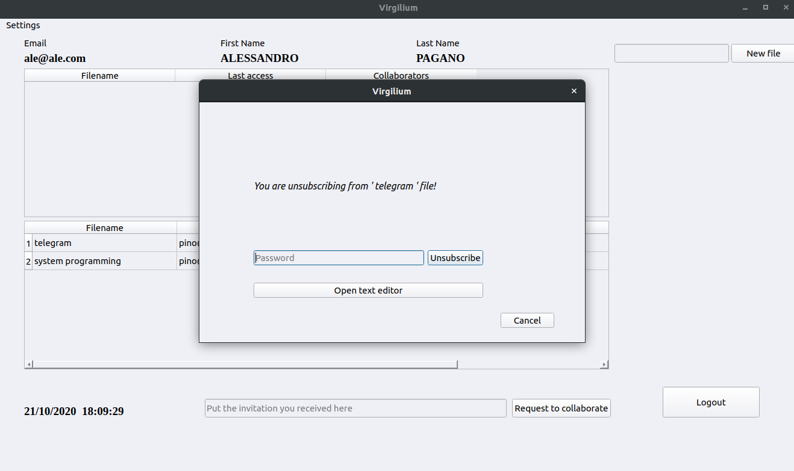

# Virgilium

Questo è il progetto del corso di Programmazione di Sistema dell'anno 2018/2019. In poche parole un real-time text editor con alla base l'algoritmo CRDT, sviluppato usando Qt (5.12.3).

Di seguito si descrive prima un'elenco delle funzionalità che vengono offerte ed in seguito si passa ad una panoramica della struttura del progetto e delle scelte algoritmiche.

Per lanciare il server:
```
./VirgiliumServer
```

Per lanciare il client:
```
./VirgiliumClient [ip address]
```


## Welcome page

* Possibilità di loggarsi con email e password dell'utente

* Possibilità di registrarsi, digitando nome, cognome, email e password

## Personal page

* Informazioni sull'utente loggato: nome, cognome, email

* Nella prima tabella vengono mostrati i file di cui l'utente loggato è il proprietario ossia il creatore. Le colonne della tabella sono: nome del file, ultimo accesso e lista dei collaboratori (indicati dalle loro mail)
    * Cliccando sul nome del filename è possibile svolgere 3 azioni: 
        * Rinominare il file, previo inserimento della password
        * Cancellare il file, previo inserimento della password
        * Aprire il text editor. Quando si chiude il text editor viene aggiornato l'ultimo accesso.
    * Cliccando sulla lista dei collaboratori è possibile svolgere 2 azioni:
        * Aggiungere un collaboratore, creando un invito (previo inserimento della password) il quale sarà poi mandato attraverso terze parti all'utente che si vuole aggiungere come collaboratore e che se vorrà accetterà di collaborare. Il codice ha validità di 24 ore.
        * Rimuovere un collaboratore, previo inserimento della password

* Nella seconda tabella vengono mostrati i file a cui l'utente loggato collabora. Le colonne della tabella sono: nome del file, proprietario, lista dei collaboratori e ultimo accesso al file da parte dell'utente
    * Cliccando sul qualsiasi colonna di un file è possibile svolgere 2 azioni:
        * Disinscriversi come collaboratore di un file
        * Aprire il text editor. Quando si chiude il text editor viene aggiornato l'ultimo accesso.

* Nella parte centrale in basso, c'è la possibilità di inserire un invito (codice) ricevuto per terze parti da un altro utente e quindi di accettare la collaborazione ad un determinato file. Il codice ha validità di 24 ore.

* In basso a destra c'è il bottone di logout. Premendo, si ritorna alla welcome page.

* In alto a destra è possibile creare un nuovo file. E' possibile creare file con lo stesso nome, il nome verra automaticamente modificato aggiungendo un "_" ed un numero nel caso di omonimia, per esempio "filename_2"

* In alto a sinitra è possibile:
    
    * cambiare tema: default e light mode
    
    * cambiare password
    

## Text editor

* In alto a sinistra è possibile vedere gli utenti che stanno attualmente modificando il file, ad ognuno di questi è assegnato un colore con il quale è possibile distinguere i diversi cursori all'interno del foglio di lavoro.

* Nella parte superiore della pagina ci sono diverse azioni che possono essere eseguite, la maggior parte di queste possono essere attivate sia dal menù che utilizzando delle apposite icone, tra le più importanti abbiamo 
   * la creazione di un file PDF con il contenuto del documento
   * le operazioni di copia, taglia e incolla
   * l'allineamento e l'indentazione
   * la possibilità di modificare il testo in corsivo, grassetto o sottolineato
   * l'opzione per sostituire tutte le occorrenze di una o più parole con delle altre
   * le azioni per modificare il font, la dimensione del testo ed anche il suo colore

* Infine, nella parte centrale della finestra c'è un foglio a disposizione dove è possibile inserire tutto ciò che farà parte del documento attualmente modificato.


# Struttura del progetto

Il progetto è diviso in 3 directory:
* client: sono presenti tutte i file .h/.cpp/.ui che rappresentano le viste del client e la classe **clientStuff** che si occupa della gestione di tutto ciò che riguarda client e server, usando la classe **ClientSocket**. 
* server: è presente la classe **server** che è quella che sfruttando la classe **ClientSocket** si occupa di gestire la connessione client-server e che sfrutta la classe **model** che si occupa di varie cose tra cui la gestione del database, usando
 la classe **database**.
* common: come si può intuire dal nome, questa cartella conserva tutti i file che sono in comune tra client e server. 
    * Nella directory common sono presenti: il file **constants.h** dove sono definite tutte le costanti usate; **User(.h/.cpp)** che rappresenta uno user e che viene usato
    all'interno del client o del server; **ClientSocket(.h/.cpp)** che verrà speigato nella sezione **Gestione comunicazione client e server**
    * Ci sono poi due directory **CRDT** e **messages** dove sono presenti rispettivamente i file che servono per attuare l'algoritmo di CRDT e i file ossia le classi
    che rappresentano i wrapper dei messaggi che vengono scambiati tra client e server
    
    
    

# Algoritmo CRDT
Per l'implementazione della logica dell'applicazione è stato utilizzato l'algoritmo CRDT, per maggiori informazioni è possibile cliccare [qui](https://conclave-team.github.io/conclave-site/#what-is-a-real-time-collaborative-text-editor).
In particolar modo sono state implementate diverse funzioni con lo scopo di raccogliere tutti i cambiamenti all'interno dell'editor di un client in modo tale da trasmettere queste informazioni al server, che ha lo scopo di distribuire i dati agli altri client interessati. Come descritto dall'algoritmo, lo sforzo è stato quello di ottenere in tutti i casi una situazione coerente nei diversi client, ottenuta rendendo l’operazione di inserimento commutativa e quella di cancellazione, oltre che commutativa, anche idempotente. Nello specifico commutabilità e idempotenza sono state ottenute aggiungendo alle proprietà base dell’oggetto (valore, posizione) proprietà quali il siteID (identificativo del client) e counterID (numero progressivo associato al carattere e assegnato dal client). Proprio per questo motivo due aspetti fondamentali sono quelli relativi alla posizione assoluta di un singolo carattere e al suo formato.

# Threading
Poiché la maggior parte delle operazioni presenti all'interno dell'applicazioni sono abbastanza veloci si è pensato di ridurre al minimo l'utilizzo dei thread. L'unico caso in cui si è utilizzato un pool di thread è stato quello relativo al salvataggio di un file, in particolar modo dopo aver calcolato la posizione corretta del singolo carattere viene utilizzato uno dei thread disponibili per effettuare il salvataggio.

# Gestione del file system

* Per gestire il file system si è pensato di creare una cartella per ogni utente usando l'email dell'utente stesso e all'interno della cartella salvare i file di cui l'utente è proprietario.
* Se un utente collabora ad un file, l'apertura del file viene fatta sfruttando il database.

# Gestione del database

* E' stato usato sqlite3 per la gestione del database

* Sono state create 4 tabelle:
    * files: id, filename, email_owner
    * users: email, firstname, lastname, password (con hash)
    * user_files: id, email, last_access
    * invitation_urls: url, id, timeout

# Gestione comunicazione client e server

La comunicazione tra client e server avviene attraverso lo scambio di diverse tipologie di messaggi.
Ciascuno di questi messaggi è individuato da un codice identificativo che specifica l’azione da svolgere, seguito dal contenuto del messaggio vero e proprio.
Nella classe **ClientSocket** il ruolo centrale è svolto dalla funzione onReadyRead. Questo slot viene chiamato ogniqualvolta dei dati sono disponibili per essere letti. Appena ciò si verifica, viene emesso un segnale verso il client o il server destinazione. In questa stessa classe sono anche definiti altri metodi che specificano l’invio dei vari messaggi. Essendo le funzioni svolte da questa classe comuni sia per il server che per il client, la classe stessa è condivisa.
In questa senso anche altre classi sono in comune: in particolare quelle relative alla definizione dei messaggi e il file costants.h dove sono elencate le costanti usate nel programma tra cui, appunto, i codici identificativi.


# Some screens
















